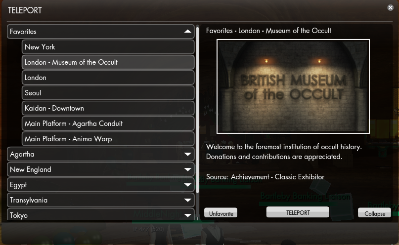

# TP
  
Adds Favorite(/Unfavorite) and Expand(/Collapse) buttons to region teleport window.  
Favorite will move the teleport entry to "Favorites" category at the top.  
Hide/Collapse will let you decide which teleport regions are expanded when opening the window  

